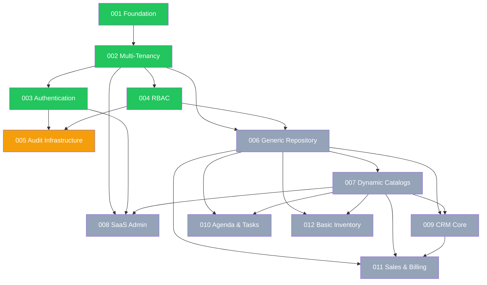

# 📊 Uyuni SaaS - Implementation Status Dashboard

> **Last Updated**: 2026-07-23
> **Constitution Version**: 1.1.0
> **Next Feature**: `specs/005-audit-infrastructure`

---

## Overall Progress

```
[████████░░░░░░░░░░░░] 4/12 modules implemented (33%)
```

## Module Implementation Status

| # | Module | Status | Spec | Prisma Models | Key Components |
|---|--------|:------:|------|---------------|----------------|
| 001 | Foundation & Bootstrap | ✅ Done | [spec](../specs/001-foundation-bootstrap/) | — | `main.ts`, `app.module.ts`, `GlobalExceptionFilter`, `RequestContextInterceptor`, `PrismaService`, `HealthModule` |
| 002 | Multi-Tenancy Core | ✅ Done | [spec](../specs/002-multi-tenancy-core/) | `Plan`, `Tenant`, `User`, `TenantUser` | `tenant-scoped.extension.ts`, `TenantContextMiddleware`, `TenantGuard`, `TenantContextService` |
| 003 | Authentication | ✅ Done | [spec](../specs/003-authentication/) | `RefreshToken` | `AuthModule`, `JwtStrategy`, `TokenService`, `LockoutService` |
| 004 | RBAC | ✅ Done | [spec](../specs/004-rbac/) | `Role`, `Permission`, `RoleAssignment` | `RbacModule`, `PermissionsGuard`, `PermissionResolverService`, `OwnershipScopeInterceptor` |
| 005 | Audit Infrastructure | 📋 Next | [spec](../specs/005-audit-infrastructure/) | — | — |
| 006 | Generic Repository & DataTables | 📋 Specified | [spec](../specs/006-generic-repository-datatables/) | — | — |
| 007 | Dynamic Catalogs | 📋 Specified | [spec](../specs/007-dynamic-catalogs/) | — | — |
| 008 | SaaS Administration | 📋 Specified | [spec](../specs/008-saas-administration/) | — | — |
| 009 | CRM Core | 📋 Specified | [spec](../specs/009-crm-core/) | — | — |
| 010 | Agenda & Tasks | 📋 Specified | [spec](../specs/010-agenda-tasks/) | — | — |
| 011 | Sales & Billing | 📋 Specified | [spec](../specs/011-sales-billing/) | — | — |
| 012 | Basic Inventory | 📋 Specified | [spec](../specs/012-basic-inventory/) | — | — |

## Current Prisma Schema (8 Models)

| Model | Table | Tenant-Scoped | Full Audit Fields |
|-------|-------|:---:|:---:|
| `Plan` | `plans` | ❌ Global | ✅ 6/6 |
| `Tenant` | `tenants` | ❌ Global | ✅ 6/6 |
| `User` | `users` | ❌ Global | ✅ 6/6 |
| `TenantUser` | `tenant_users` | ✅ Required | ✅ 6/6 |
| `RefreshToken` | `refresh_tokens` | ❌ Global | ⚠️ 5/6 (isRevoked instead of isActive) |
| `Role` | `roles` | ⚠️ Optional | ✅ 6/6 |
| `Permission` | `permissions` | ❌ Via Role | ⚠️ 2/6 |
| `RoleAssignment` | `role_assignments` | ❌ Via TenantUser | ⚠️ 3/6 + assignedById |

## Technology Stack (Verified)

| Layer | Package | Installed Version |
|-------|---------|:-----------------:|
| Framework | `@nestjs/common` | `^11.0.1` |
| ORM | `@prisma/client` | `^7.8.0` |
| DB Adapter | `@prisma/adapter-pg` | `^7.8.0` |
| Auth | `@nestjs/jwt` | `^11.0.2` |
| Password Hash | `bcryptjs` | `^3.0.3` |
| Validation | `class-validator` | `^0.15.1` |
| Logging | `nestjs-pino` | `^4.6.1` |
| Env Validation | `zod` | `^4.4.3` |
| Rate Limiting | `@nestjs/throttler` | `^6.5.0` |
| Security | `helmet` | `^8.2.0` |
| API Docs | `@nestjs/swagger` | `^11.4.5` |
| Health | `@nestjs/terminus` | `^11.1.1` |
| Testing | `jest` | `^30.0.0` |
| E2E Containers | `@testcontainers/postgresql` | `^12.0.4` |
| TypeScript | `typescript` | `^5.7.3` |

## Global Guard Chain (Execution Order)

```
Request → TenantContextMiddleware → ThrottlerGuard → JwtAuthGuard
        → TenantGuard → PermissionsGuard → PlatformAdminGuard
        → OwnershipScopeInterceptor → SuperadminAuditInterceptor
        → Controller
```

## Dependency Graph (Implementation Order)



**Legend**: 🟢 Implemented | 🟡 Next | ⬜ Specified

## Documentation Sources

| Document | Path | Purpose |
|----------|------|---------|
| Constitution (canonical) | `.specify/memory/constitution.md` | Supreme governance document |
| Constitution (reference) | `docs/uyuni-saas-constitution.md` | Spanish reference copy |
| Agent Rules | `.agents/AGENTS.md` | AI agent behavior rules |
| Feature Specs | `specs/001-012/` | Detailed feature specifications |
| Tenancy Guide | `docs/tenancy.md` | Multi-tenancy architecture guide |
| Bootstrap Guide | `docs/001-foundation-bootstrap-reproducibility-guide.md` | Step-by-step setup |
| README | `README.md` | Quick start instructions |
