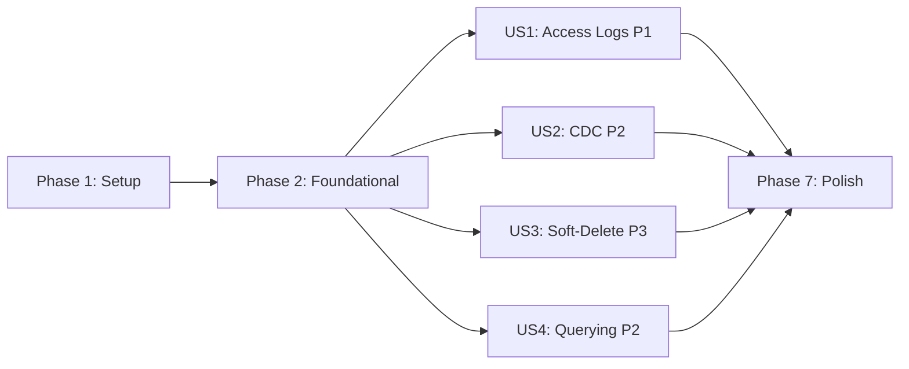

# Tasks: Audit Infrastructure

**Input**: Design documents from `/specs/005-audit-infrastructure/`

**Prerequisites**: plan.md, spec.md, research.md, data-model.md, contracts/audit-api.md, quickstart.md

**Tests**: E2E test tasks included to validate Success Criteria (SC-001 through SC-005) as mandated by Constitution Principle IV.

**Organization**: Tasks grouped by user story to enable independent implementation.

## Format: `[ID] [P?] [Story] Description`

- **[P]**: Can run in parallel (different files, no dependencies)
- **[Story]**: Which user story (US1, US2, US3, US4)
- Exact file paths included in all descriptions

---

## Phase 1: Setup (Schema & Shared Infrastructure)

**Purpose**: Prisma schema changes, migrations, and shared constants that all user stories depend on.

- [ ] T001 Add `ChangeAction` enum (`CREATE`, `UPDATE`, `DELETE`) to `prisma/schema.prisma`
- [ ] T002 Add `AccessLog` model with indexes `(tenantId, timestamp DESC)`, `(requestId)`, `(userId, timestamp DESC)` to `prisma/schema.prisma`
- [ ] T003 Add `ChangeRecord` model with indexes `(tenantId, entityType, entityId)`, `(requestId)`, `(tenantId, timestamp DESC)` to `prisma/schema.prisma`
- [ ] T004 Normalize `Permission` model: add `createdById`, `updatedById`, `deletedById`, `isActive` fields and User relations to `prisma/schema.prisma`
- [ ] T005 Normalize `RoleAssignment` model: add `createdById`, `updatedById`, `deletedById` fields and User relations to `prisma/schema.prisma`
- [ ] T006 Add reverse relations on `User` model for `AccessLog`, `ChangeRecord`, `Permission` audit FKs, `RoleAssignment` audit FKs in `prisma/schema.prisma`
- [ ] T007 Run `npx prisma migrate dev --name 005-audit-infrastructure` to generate and apply migration
- [ ] T007b Create custom SQL migration for partial unique indexes — replace existing unique constraints on `users(email)`, `tenants(slug)`, `roles(tenant_id, name)` with partial unique indexes: `CREATE UNIQUE INDEX ... WHERE is_active = true`. This prevents soft-deleted records from blocking reuse of unique values. Add as raw SQL in `prisma/migrations/` (Prisma does not support partial indexes natively).
- [ ] T008 [P] Create sensitive fields registry at `src/common/constants/sensitive-fields.ts` with initial entries: `User.passwordHash`, `RefreshToken.tokenHash`
- [ ] T009 [P] Create shared cursor pagination DTO at `src/modules/audit/dto/cursor-pagination.dto.ts` with `cursor` (optional string), `limit` (optional int, default 50, max 200), and response shape `{ data: T[], cursor: string | null, hasNext: boolean }`

---

## Phase 2: Foundational (Prisma Extensions)

**Purpose**: Core Prisma extensions that MUST be complete before user story implementation. These extensions compose via the `$extends` chain in `PrismaService`.

**⚠️ CRITICAL**: No user story work can begin until this phase is complete.

- [ ] T010 Create append-only extension at `src/infrastructure/prisma/extensions/append-only.extension.ts` — reject `update`, `updateMany`, `delete`, `deleteMany` on `AccessLog` and `ChangeRecord` models with `ForbiddenException`
- [ ] T011 Create audit-columns extension at `src/infrastructure/prisma/extensions/audit-columns.extension.ts` — intercept `create` (inject `createdById` from `TenantContextService.getUserId()`), `update`/`updateMany` (inject `updatedById`). Note: the existing `tenant-scoped.extension.ts` already does this for tenant-scoped models; this extension handles NON-tenant-scoped models (User, Plan, etc.)
- [ ] T012 Create CDC extension at `src/infrastructure/prisma/extensions/cdc.extension.ts` — intercept `create`/`update`/`delete` on ALL models (except `AccessLog` and `ChangeRecord`). CRITICAL: Add guard clause at the TOP of `$allOperations`: `if (model === 'ChangeRecord' || model === 'AccessLog') return query(args)` to prevent infinite recursion. Fetch old_value via `findFirst` before mutation, capture new_value after mutation, redact sensitive fields using `redactSensitiveFields()` utility (T012b), write `ChangeRecord` entry. For GLOBAL models (not in TENANT_SCOPED_MODELS), wrap the findFirst + mutation + ChangeRecord write in an explicit `$transaction` to prevent race conditions. Must be best-effort: wrap in try/catch, log CRITICAL on failure, never throw.
- [ ] T012b [P] Create redaction utility at `src/common/utils/redact-sensitive-fields.ts` — export `redactSensitiveFields(modelName: string, data: Record<string, unknown>): Record<string, unknown>` that reads `SENSITIVE_FIELDS` registry and replaces matching field values with `"[REDACTED]"`. Keep CDC extension thin by delegating redaction here.
- [ ] T013 Register all new extensions in `src/infrastructure/prisma/prisma.service.ts` — chain order: `tenantScopedExtension` → `auditColumnsExtension` → `cdcExtension` → `appendOnlyExtension`. Update constructor `$extends` calls.
- [ ] T014 Handle `AccessLog` and `ChangeRecord` tenant scoping — these models have NULLABLE `tenantId` (for unauthenticated/public requests). Do NOT add them to `TENANT_SCOPED_MODELS` (which requires non-null tenantId). Instead, the `AccessLogInterceptor` and `cdcExtension` will set `tenantId` from context when available or leave it null. The `AccessLogService` and `ChangeRecordService` will manually filter by `tenantId` in their query methods. Document this decision in a comment in `src/infrastructure/prisma/extensions/tenant-scoped-models.ts`.
- [ ] T015 Create PostgreSQL migration script for `REVOKE UPDATE, DELETE ON access_logs, change_records FROM application_role` — add to `prisma/migrations/` as a custom SQL step or document in `docs/005-audit-db-hardening.md`

**Checkpoint**: Extension chain complete — all Prisma operations now automatically generate audit columns, CDC records, and protect audit tables.

---

## Phase 3: User Story 1 — Access Log Capture (Priority: P1) 🎯 MVP

**Goal**: Every API request is automatically captured by a global interceptor that records method, route, status, IP, user-agent, userId, tenantId, requestId, durationMs, and timestamp.

**Independent Test**: Make several authenticated requests. Query the `access_logs` table directly and verify all requests are recorded with correct details.

### Implementation

- [ ] T016 [US1] Create `AccessLogInterceptor` at `src/common/interceptors/access-log.interceptor.ts` — implement `NestInterceptor`, inject `PrismaService` and `TenantContextService`. CRITICAL: Do NOT read `statusCode` from within the RxJS `tap`/`catchError` stream (interceptors run before Exception Filters, so status would be wrong). Instead, use `res.on('finish', () => { ... })` to capture the FINAL statusCode after the GlobalExceptionFilter has run. Record: `method`, `route` (from `req.url`), `statusCode` (from `res.statusCode` inside `finish` event), `ip` (from `req.ip`), `userAgent` (from `req.headers['user-agent']`), `userId` (from context), `tenantId` (from context), `requestId` (from `TenantContextService.getRequestId()`), `durationMs` (calculate from `Date.now()` diff), `timestamp`. Must be best-effort: wrap Prisma write in try/catch, log CRITICAL via pino on failure, never throw.
- [ ] T017 [US1] Register `AccessLogInterceptor` as global `APP_INTERCEPTOR` in `src/app.module.ts` — add `{ provide: APP_INTERCEPTOR, useClass: AccessLogInterceptor }` AFTER existing interceptors
- [ ] T018 [US1] Write E2E test for SC-001 (100% access log coverage) at `test/audit/access-log-capture.e2e-spec.ts` — test authenticated requests, unauthenticated requests, success responses, and error responses all generate access log entries with correct fields. Verify that AccessLog write failure does not block the business response.

**Checkpoint**: Every API request now generates an access log entry. US1 is independently testable.

---

## Phase 4: User Story 2 — Change Data Capture / CDC (Priority: P2)

**Goal**: Every data modification (create, update, delete) is captured as an immutable ChangeRecord showing old_value, new_value, actor, requestId, and timestamp. Sensitive fields are redacted.

**Independent Test**: Create, update, and delete a record. Query `change_records` table and verify 3 entries exist with correct old/new values. Verify sensitive fields show "[REDACTED]".

### Implementation

- [ ] T019 [US2] Implement old_value fetching strategy in `src/infrastructure/prisma/extensions/cdc.extension.ts` — for `update`/`delete` operations, perform a `findFirst({ where: { id } })` BEFORE the mutation to capture the pre-mutation snapshot. For `create`, old_value is null.
- [ ] T020 [US2] Implement sensitive field redaction in CDC extension — import `SENSITIVE_FIELDS` registry, iterate over old_value/new_value JSON snapshots, replace matching field values with `"[REDACTED]"`
- [ ] T021 [US2] Implement new_value capture — for `create`/`update`, capture the result of the mutation as new_value. For `delete` (soft-delete), new_value shows the record with `isActive: false`.
- [ ] T022 [US2] Implement ChangeRecord write — after capturing old_value and new_value, write to `ChangeRecord` with `entityType` (Prisma model name), `entityId`, `action` (CREATE/UPDATE/DELETE), `actorId`, `tenantId`, `requestId`, `timestamp`. Must be best-effort.
- [ ] T023 [US2] Write E2E test for SC-002 (100% CDC coverage) at `test/audit/cdc-capture.e2e-spec.ts` — perform create, update, and delete on a domain entity. Verify 3 ChangeRecord entries with correct action, old_value, new_value. Verify CDC write failure does not block business operation.
- [ ] T023b [US2] Write E2E test for SC-005 (sensitive field redaction) at `test/audit/cdc-redaction.e2e-spec.ts` — create a User (has passwordHash), verify the ChangeRecord's new_value contains `"[REDACTED]"` instead of the actual hash. Create a RefreshToken, verify tokenHash is redacted.

**Checkpoint**: Every data mutation now generates an immutable CDC record. US2 is independently testable.

---

## Phase 5: User Story 4 — Audit Trail Querying & Correlation (Priority: P2)

**Goal**: Auditors can query access logs and CDC records via REST endpoints with cursor-based pagination. Every CDC entry includes a requestId that correlates to the access log entry that triggered it.

**Independent Test**: Make 3 requests that modify data. Query access logs filtered by date range. Pick one access log entry, use its requestId to find corresponding CDC entries.

### Implementation

- [ ] T024 [P] [US4] Create `AccessLogQueryDto` at `src/modules/audit/dto/access-log-query.dto.ts` — extend cursor pagination DTO with optional filters: `startDate` (ISO string), `endDate` (ISO string), `userId` (UUID), `route` (string contains match)
- [ ] T025 [P] [US4] Create `ChangeRecordQueryDto` at `src/modules/audit/dto/change-record-query.dto.ts` — extend cursor pagination DTO with optional filters: `entityType` (string), `entityId` (UUID), `startDate`, `endDate`, `actorId` (UUID), `action` (ChangeAction enum)
- [ ] T026 [US4] Create `AccessLogService` at `src/modules/audit/services/access-log.service.ts` — inject `PrismaService`, implement `findMany` with cursor-based pagination (`WHERE (timestamp, id) < cursor ORDER BY timestamp DESC, id DESC LIMIT N+1`), tenant-scoped filtering, and date range/userId/route filters. Implement `findByRequestId`.
- [ ] T027 [US4] Create `ChangeRecordService` at `src/modules/audit/services/change-record.service.ts` — inject `PrismaService`, implement `findMany` with cursor-based pagination, tenant-scoped filtering, entity type/ID/date range/actor/action filters. Implement `findByEntityHistory` and `findByRequestId`.
- [ ] T028 [US4] Create `AccessLogsController` at `src/modules/audit/controllers/access-logs.controller.ts` — `GET /audit/access-logs` (list with filters), `GET /audit/access-logs/:requestId` (single lookup). Apply `@RequirePermissions({ module: 'audit', action: PermissionAction.READ })`. Add OpenAPI decorators.
- [ ] T029 [US4] Create `ChangeRecordsController` at `src/modules/audit/controllers/change-records.controller.ts` — `GET /audit/change-records` (list with filters), `GET /audit/change-records/entity/:entityType/:entityId` (entity history), `GET /audit/change-records/request/:requestId` (correlation). Apply `@RequirePermissions`. Add OpenAPI decorators.
- [ ] T030 [US4] Create `AuditModule` at `src/modules/audit/audit.module.ts` — import `PrismaModule`, declare controllers and services, export services
- [ ] T031 [US4] Register `AuditModule` in `src/app.module.ts` — add to imports array
- [ ] T032 [US4] Seed `audit` module permissions in RBAC — ensure `audit:READ` permission exists for Auditor and Admin system roles. Add seed data or migration.
- [ ] T033 [US4] Verify audit querying by making requests, then querying via audit endpoints — confirm cursor pagination works, filters work, and requestId correlation returns matching CDC entries

**Checkpoint**: Auditors can now query access logs and CDC records. Request-to-mutation correlation works. US4 is independently testable.

---

## Phase 6: User Story 3 — Soft-Delete & Automatic Audit Columns (Priority: P3)

**Goal**: Physical deletes are converted to soft-deletes (isActive=false). Audit columns (createdById, updatedById, deletedById) are automatically injected without developer effort.

**Independent Test**: Delete a record via API, verify it still exists with isActive=false and deletedById set. Create a record, verify createdById is set automatically. List records, verify soft-deleted records are excluded.

### Implementation

- [ ] T034 [US3] Create shared soft-delete utility at `src/common/utils/soft-delete.ts` — export `convertToSoftDelete(args, userId)` that transforms a `delete`/`deleteMany` operation into `update({ data: { isActive: false, deletedById: userId } })`. This utility is shared by both `tenant-scoped.extension.ts` and `audit-columns.extension.ts` to avoid DRY violation.
- [ ] T034b [US3] Modify `tenant-scoped.extension.ts` at `src/infrastructure/prisma/extensions/tenant-scoped.extension.ts` — intercept `delete` and `deleteMany` operations on tenant-scoped models: use `convertToSoftDelete()` utility from T034 to convert to `update({ data: { isActive: false, deletedById: userId } })` instead of physical deletion.
- [ ] T035 [US3] Modify `audit-columns.extension.ts` at `src/infrastructure/prisma/extensions/audit-columns.extension.ts` — add soft-delete interception for non-tenant-scoped models: use `convertToSoftDelete()` utility from T034 for the same transformation.
- [ ] T036 [US3] Modify `tenant-scoped.extension.ts` read filter — add `isActive: true` to the default WHERE clause in `injectReadFilter` function so soft-deleted records are excluded from list queries by default
- [ ] T037 [US3] Add `includeDeleted` query parameter support — create a mechanism (decorator or query param) that allows auditors with `audit:read` permission to bypass the `isActive: true` filter. Update read filter logic to check for this flag.
- [ ] T038 [US3] Verify existing delete operations are converted to soft-deletes — test on TenantUser: call delete, confirm record exists with isActive=false and deletedById set, confirm record doesn't appear in list endpoints
- [ ] T039 [US3] Verify audit columns are auto-populated — create a record and confirm createdById is set without passing it explicitly. Update a record and confirm updatedById is set.

**Checkpoint**: All deletes are now soft-deletes. Audit columns are fully automatic. US3 is independently testable.

---

## Phase 7: Polish & Cross-Cutting Concerns

**Purpose**: Documentation, performance verification, and cross-story integration.

- [ ] T040 [P] Add `AUDIT_RETENTION_DAYS` env variable to `src/common/config/env.validation.ts` — validate with Zod, default to `null` (indefinite), add to ConfigService
- [ ] T041 [P] Update `docs/STATUS.md` — mark spec 005 as ✅ Implemented, update Prisma model count from 8 to 10, update progress to 5/12 (42%)
- [ ] T042 [P] Update `.specify/memory/constitution.md` — update Implementation Status section to mark 005 as implemented
- [ ] T043 Run quickstart.md validation scenarios — execute all 6 scenarios from `specs/005-audit-infrastructure/quickstart.md` end-to-end
- [ ] T044 Performance verification (NFR-001) — measure access log + CDC write overhead per request, confirm <15ms
- [ ] T044b Performance verification (NFR-004) — seed `access_logs` and `change_records` with 30 days of synthetic data (~500K rows each), then run audit query endpoints and confirm all responses return in < 2 seconds. Document results.
- [ ] T045 Write E2E test for SC-004 (append-only protection) at `test/audit/append-only.e2e-spec.ts` — verify that attempting to update or delete an AccessLog or ChangeRecord via Prisma is rejected with ForbiddenException. Verify that direct SQL `UPDATE`/`DELETE` on `access_logs` and `change_records` is rejected by PostgreSQL REVOKE.
- [ ] T045b Write E2E test for SC-003 (zero-code audit columns) at `test/audit/audit-columns-auto.e2e-spec.ts` — create a domain entity without passing createdById, verify it is automatically set to the authenticated user's ID. Update the entity, verify updatedById is set. Soft-delete, verify deletedById is set.

---

## Dependencies & Execution Order

### Phase Dependencies

- **Setup (Phase 1)**: No dependencies — start immediately
- **Foundational (Phase 2)**: Depends on Phase 1 (schema + migration must exist) — BLOCKS all user stories
- **US1 Access Logs (Phase 3)**: Depends on Phase 2 — can start immediately after
- **US2 CDC (Phase 4)**: Depends on Phase 2 — can run in PARALLEL with US1
- **US4 Querying (Phase 5)**: Depends on Phase 2 — can run in PARALLEL with US1/US2 (queries existing data)
- **US3 Soft-Delete (Phase 6)**: Depends on Phase 2 — can run in PARALLEL with US1/US2/US4 but recommended LAST because it changes delete behavior globally
- **Polish (Phase 7)**: Depends on all user stories being complete

### User Story Dependencies



### Within Each User Story

- DTOs before Services
- Services before Controllers
- Controllers before Module registration
- Module registration before AppModule import

### Parallel Opportunities

- T008 and T009 can run in parallel (different files)
- T024 and T025 can run in parallel (different DTOs)
- T040, T041, T042 can all run in parallel (different files)
- After Phase 2, US1/US2/US4 can start simultaneously

---

## Parallel Example: User Story 4 (Querying)

```bash
# Launch DTOs in parallel:
Task: "Create AccessLogQueryDto in src/modules/audit/dto/access-log-query.dto.ts"
Task: "Create ChangeRecordQueryDto in src/modules/audit/dto/change-record-query.dto.ts"

# Then services (sequential - depend on DTOs):
Task: "Create AccessLogService in src/modules/audit/services/access-log.service.ts"
Task: "Create ChangeRecordService in src/modules/audit/services/change-record.service.ts"
```

---

## Implementation Strategy

### MVP First (User Story 1 Only)

1. Complete Phase 1: Setup (schema + migration)
2. Complete Phase 2: Foundational (extensions)
3. Complete Phase 3: US1 Access Log Capture
4. **STOP and VALIDATE**: Every API request generates an access log entry
5. Deploy/demo if ready

### Incremental Delivery

1. Setup + Foundational → Extension chain ready
2. Add US1 → Access logs captured → Deploy (MVP!)
3. Add US2 → CDC records captured → Deploy
4. Add US4 → Audit querying available → Deploy
5. Add US3 → Soft-delete activated → Deploy (⚠️ breaking change in delete behavior)
6. Polish → Full validation → Production ready

### Parallel Team Strategy

With 2+ developers after Phase 2:
- Developer A: US1 (Access Logs) + US3 (Soft-Delete)
- Developer B: US2 (CDC) + US4 (Querying)

---

## Notes

- [P] tasks = different files, no dependencies
- [Story] label maps task to specific user story for traceability
- Each user story is independently completable and testable
- Soft-delete (US3) is recommended LAST because it's a breaking change in delete behavior
- All Prisma extension writes are best-effort: try/catch + CRITICAL log on failure
- Commit after each task or logical group
- Stop at any checkpoint to validate story independently
- `.js` extensions are REQUIRED in all TypeScript imports (ESM)
